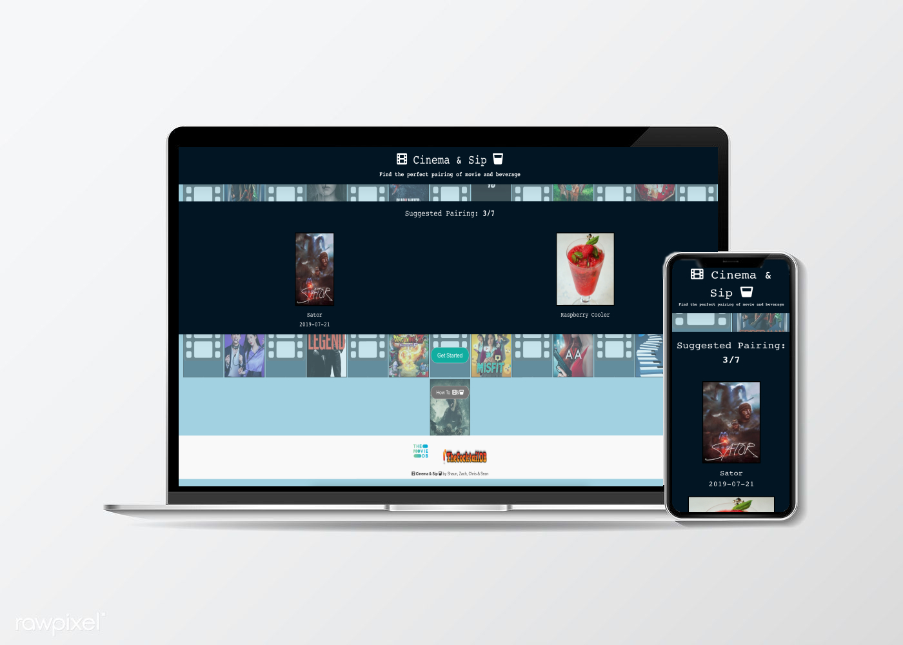

# CinemaAndSip | <a href="https://st12345678910.github.io/CinemaAndSip/"><strong>Deployed Site<strong></a>

  
 ## Overview:
  
Are you ever stuck scrolling through Netflix, just so undecided on what you are going to watch? To make matters worse, your friend, partner or even the inner you starts to get impatient and lashes out at you even though they have provided you with ZERO help on your quest to find the perfect movie for movie night. All of sudden now you need a drink too! This where you quickly solve your nightmare by heading on over to Cinema & Sip, where we match your movie with the perfect cocktail so we can get your Movie Night back on track with style. At Cinema & Sip, you can browse through our pairings by selecting movie genres and alcohol types. Uncertain what goes into a Hot Toddy? Don’t worry, we got you. The ingredients to each drink are available to you as soon as you get your pairings. Don’t waste another minute and head on over to Cinema & Sip where your feature film and drink are waiting for you.
 

  ## Technologies:
  
The two APIs that are utilized, TMDB and TheCocktailDB, are consistently updated,
  ensuring the user relevant and new results as they use the app over time. The frame-work
  and logic of the application are based on <code>JavaScript</code> and <code>jQuery</code>. For styling the <code>Bulma</code>    CSS library was used, as it is a modern mobile-first styling library with intuitive implementation.
  
  <h3>Developers:</h3> Zach Hsu, Shaun Tehranchi, Sean Cruz, Chris Vazquez
 

   <h3 aligh="center">Try on mobile and desktop!
    

  
